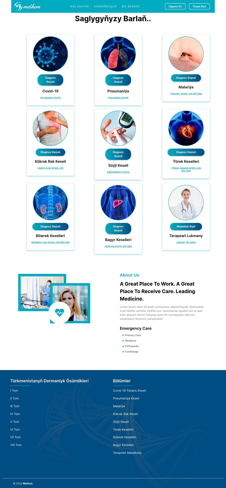

# Melhem your online hospital

Melhem is an innovative healthcare project designed to automate patient diagnosis based on medical parameters such as blood pressure, glucose quantity, and more. Additionally, it provides highly accurate detection of pneumonia and malaria from input images using advanced machine learning and deep learning techniques. Leveraging Python 3.7 libraries like Keras, scikit-learn, and TensorFlow, Melhem delivers precise and efficient algorithms for medical analysis.

## Screenshots



<!--  -->

## Project Highlights:

- Automated Patient Diagnosis:

  - Input essential medical parameters for an automated diagnosis.
  - Facilitates quick and accurate health assessments.

- Image Analysis for Disease Detection:

  - Detects pneumonia and malaria from input images.
  - Utilizes machine learning and deep learning to achieve high accuracy.

- Chat Application for Patient-Doctor Communication:
  - Implements a real-time chat application for seamless communication.
  - Enables patients to interact with doctors, providing a holistic healthcare experience.

## Technology Stack:

- **Python 3.7:**
  - Core language for project development.
- **Keras, scikit-learn, TensorFlow:**
  - Essential libraries for implementing machine learning and deep learning algorithms.
- **Flask:**
  - Powers the web application for a user-friendly interface.

## Installation:

1. **Clone the repository:**
   ```bash
   git clone https://github.com/your-username/melhem.git
   cd melhem
   ```
2. **Install dependencies:**
   ```bash
   pip install -r requirements.txt
   ```

## Usage:

1. **Run the Flask application:**

   ```bash
   python run.py
   ```

   Access the application at http://localhost:5100 in your browser.

2. **Automated Patient Diagnosis:**

   - Visit `/breast-cancer` to input medical parameters for **Breast Cancer**.
   - Visit `/diabetes` to input medical parameters for **Diabetes**.
   - Visit `/heart` to input medical parameters for **Heart Disease**.
   - Visit `/kidney` to input medical parameters for **Kidney Disease**.
   - Visit `/liver` to input medical parameters for **Liver Disease**.

3. **Image Analysis:**

   - Navigate to `/covid-19` to upload images for **Covid-19** disease detection.
   - Navigate to `/pneumonia` to upload images for **Pneumonia** detection.
   - Navigate to `/malaria` to upload images for **Malaria** detection.

4. **Chat Application:**
   - Engage in real-time communication by visiting `/advice`.

## Contribution Guidelines:

Contributions are welcome! Follow these steps:

1. Fork the repository.
2. Create a new branch for your feature or bug fix.
3. Make changes and commit with descriptive messages.
4. Push changes to your fork.
5. Submit a pull request to the `master` branch.

## License:

This project is licensed under the [MIT License](LICENSE.md).
